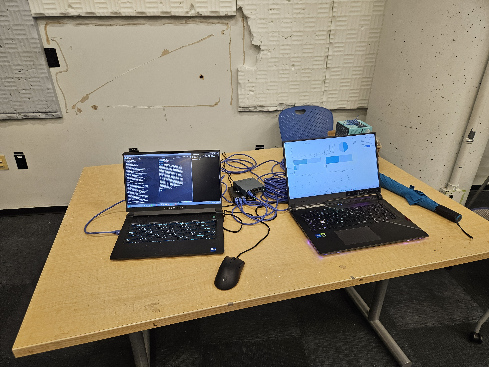
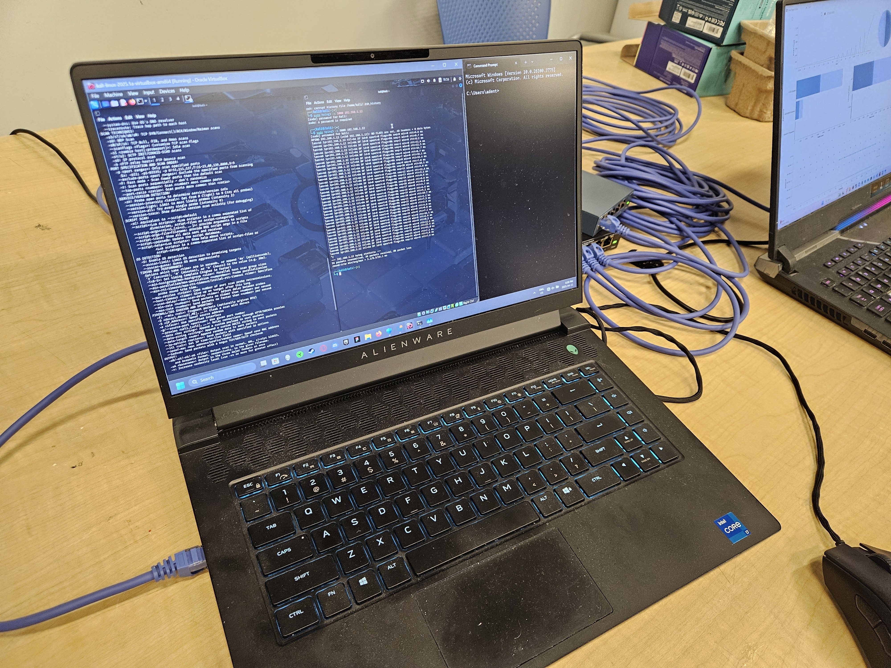
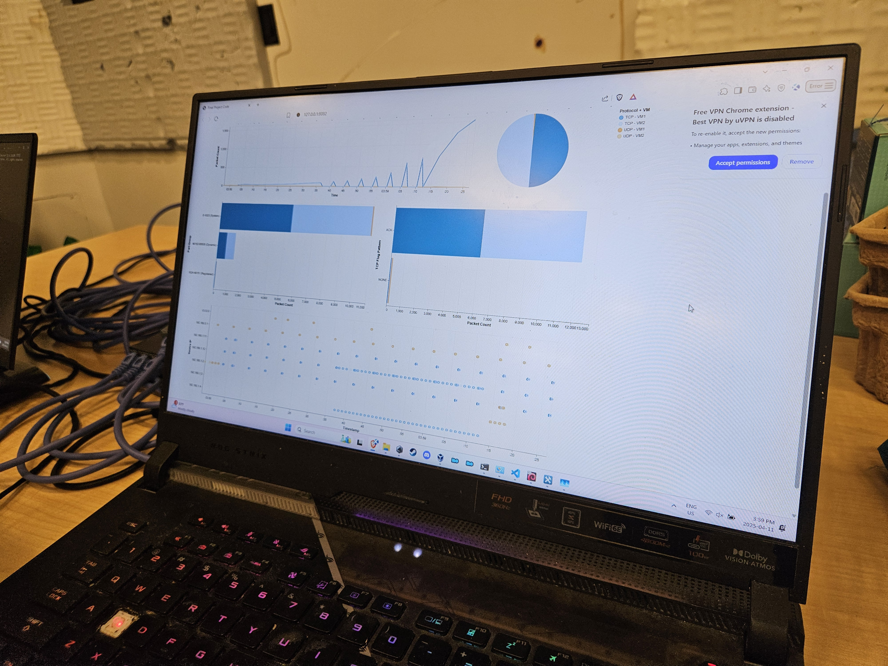
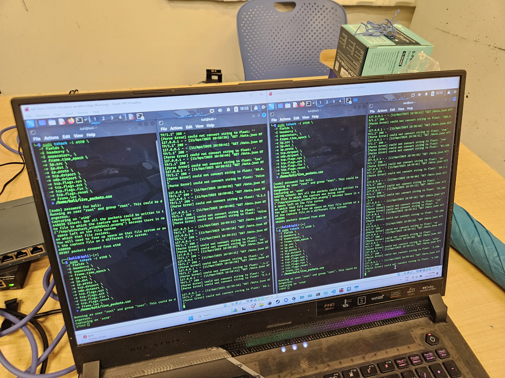

# Network SIEM Dashboard (IAT 355 Final Project)

> A real-time, lightweight network monitoring dashboard built for cybersecurity simulation, combining **Python**, **Observable Runtime**, and **VLAN-isolated Kali Linux VMs**.

This project simulates a basic SIEM (Security Information and Event Management) system in a controlled red/blue team testbed. It visualizes live packet data to detect port scans, SYN/ICMP floods, and suspicious network activity using dynamic filters, brushing, and protocol analysis.

---

## Features
- Real-time traffic monitoring from multiple VMs
- Protocol breakdown (TCP/UDP), port range analysis, and TCP flag inspection
- Live brushing, filtering, and packet drill-down (source IP, flags, destination)
- Observable-based dashboard with custom JS for streaming visualization
- Data piped from `tshark` via `Flask` and `SSH` tunneling

---

## System Architecture

### Red Team (Attacker)
- Tools: `nmap`, `hping3`, `Armitage`
- Attacks: SYN Flood, ICMP Flood, Slow Scans

### Blue Team (Defender)
- Tool: `tshark` capturing packets on VLAN interface
- Hardware: TL-SG105E switch (VLAN 10)
- Role: Packet capture, stream via SSH to local dashboard

### Observable Dashboard (Local)
- Runs via `@observablehq/runtime`
- Consumes live JSON from Flask
- Displays: line graph, pie chart, bar charts (port group + TCP flag), dot plot

---

## Setup Guide

### Observable Local Runtime Setup
```bash
npm install @observablehq/runtime@5
npm install https://api.observablehq.com/d/56ba25a95f74523d@661.tgz?v=3
```

Sample HTML entry point:
```html
<script type="module">
  import { Runtime, Inspector } from "https://cdn.jsdelivr.net/npm/@observablehq/runtime@5/+esm";
  import define from "./src/observable_dashboard.js";

  const main = new Runtime().module(define, name => {
    if (name === "viewof dashBoard") return new Inspector(document.body);
  });
</script>
```

### Flask Packet Stream Setup
```bash
# 1. Start tshark capture on Blue Team Kali VM
sudo tshark -i eth0.10 -T fields \
-e frame.time_epoch -e ip.src -e ip.dst -e ip.proto \
-e tcp.dstport -e udp.dstport -e tcp.flags.syn \
-e tcp.flags.ack -e tcp.flags.fin -e tcp.flags.reset \
-e frame.len -E header=y -E separator=, > /tmp/live_packets.csv

# 2. Start Flask JSON backend
python3 serve_json.py
```

### SSH Tunnel to Local Machine
```bash
# On your host machine:
ssh -L 8081:localhost:8080 kali@192.168.1.x
```

---

## Example Attacks

### ICMP Flood
```bash
sudo hping3 --icmp --flood -d 120 -p 80 192.168.1.x
```

### SYN Flood
```bash
sudo hping3 -S --flood -V -p 80 192.168.1.x
```

### Port Scan
```bash
sudo nmap -sV -T4 192.168.1.x
```

---

## Screenshots

| VLAN Setup | Armitage Attack | Live Dashboard (Scan) | Live Dashboard (Flood) |
|------------|------------------|------------------------|--------------------------|
|  |  |  |  |

[Watch the demo video (MP4)](https://youtu.be/mx0S6QVGlXw)


---

## Credits & License

Built by:  
- Qian ZhongJun — Full system architect, Python + Observable engineer, testbed designer  
- Aden Trathen — Supporting design and documentation

This project is released under the [MIT License](./LICENSE).

---

## Documentation

- [`Personal_Contribution.pdf`](docs/Personal_Contribution.pdf)
- [`VLAN_Setup_Blue.pdf`](docs/VLAN_Setup_Blue.pdf)
- [`Attacker_Guide_Red.pdf`](docs/Attacker_Guide_Red.pdf)
- [`Project_Proposal.pdf`](docs/Project_Proposal.pdf)
- [`IAT 355 Final Project Report.pdf`](docs/IAT%20355%20Final%20Project%20Report.pdf)
